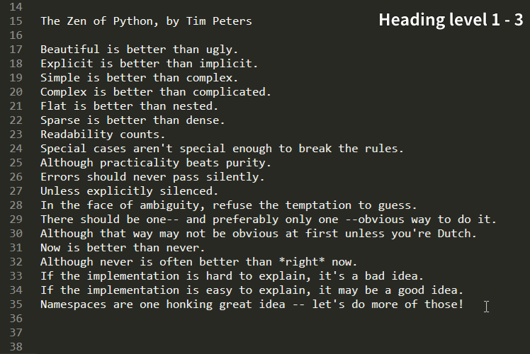

<p align="center">
	
</p>

注意：这只是我以个人习惯写成的一份 Markdown（下面写作 md）指南，毕竟每个人的习惯不同，如果不喜欢或者觉得是篇辣鸡指南可以无视。

## Table of Contents
- [写在前面的话](#写在前面的话)
- [文件名](#文件名)
- [目录](#目录)
- [标题](#标题)
- [正文](#正文)
- [图片](#图片)
- [列表](#列表)
- [代码](#代码)
- [超链接](#超链接)
- [表格](#表格)
- [公式](#公式)
- [图表题注与文件路径](#图表题注与文件路径)
- [参考](#参考)

## 写在前面的话

写这篇所谓的指南目的是强制自己去执行一个所谓的标准，因为有时候自己觉得一种写法很棒，应该作为标准，之后就忘记了（鱼的记忆），所以记下来可供查询。

早就想写一份属于自己的 md 写作指南了，一直拖拖拉拉没写（懒），自从接触 md（应该是大三暑假实习，在实验室第一次接触到）之后就放弃了其他的记笔记文档格式（txt or docx），为啥？因为 md 它有多种格式（相比 txt），语法简单，轻量级（相比 docx），所见即所得，我习惯是用 Chrome + Markdown Preview Plus 看 md 文档。

中英文应该自觉加上空格，网上也有大量格式化的工具或者网站，复制粘贴就可以得到一份空格分隔后的文档，如果懒得找，我这里有一个小工具：[pangu](https://github.com/taseikyo/PyQt5-Apps#pangu)，它是基于 [pangu.py](https://github.com/vinta/pangu.py) 用 PyQt 套了个壳子的小工具。

最后推荐自己写的一个 Sublime Text 的一个插件：[sublime-markdown-helper](https://github.com/taseikyo/backup-utils/blob/master/Python/00D.sublime-markdown-helper.7z)。该插件可以加速 md 文档的书写（大概），基本是常用的几个样式，所有格式都需要全段落选择，效果如下所示：



## 文件名

1. 文件名不应该出现空格，如果需要请使用连字符（"-"）连接。

```
markdown guide.md ×
markdown-guide.md √
```

2. 如果出现中英文怎么办？参考上面规定：使用连字符连接。

```
python使用指南.pdf  ×
python 使用指南.pdf ×
python-使用指南.pdf √
```

3. 文件名中的英文字母应该都为小写字母，无论是否为专有单词，就像上面的一个示例。

## 目录

每篇 md 文档都应该有一个目录，方便跳转，同时也方便有个对整个文档的全局了解。为此我还自己写了一个 [Python 脚本](https://github.com/taseikyo/backup-utils/blob/master/Python/006_auto_generate_toc.py) 来自动生成目录，因为是直接计算开头的井号数（"#"），可能有些 bug 或者格式问题，最终需要自己手动微调一下。

## 标题

1. 标题也应遵循中英文加空格的规定。

```
# title标题 ×
# title 标题 √
```

2. 标题跟其他格式之间应该加一个空行，这里其他格式是指任何格式，标题、正文或者段落等等。

错误示范：

```
# title1
## title2

# title1
sentence

# title1
- p1
- p2
```

正确示范：

```
# title1

## title2

# title1

sentence

# title1

- p1
- p2
```

3. 关于标题格式，请使用井号（"#"），而不要使用等于号（"="）或者连字符（"-"）

错误示范：

```
标题标题标题
=================
```

正确示范：

```
# 标题标题标题
```

4. 标题最多应使用到三级，因为对于四级及以上渲染出来字体比正文还小，已经不太好看了。

## 正文

1. 中英文之间加空格是必须的。

2. 段落换行多加一个空行（回车），如果只有一个回车，有些网站（GitHub）仍然会渲染成一个段落。

错误示范：

```
sentence1
sentence2
```

正确示范：

```
sentence1

sentence2
```

3. 正文与列表之间要加空行。

错误示范：

```
sentence
- p1
- p2
```

正确示范：

```
sentence

- p1
- p2
```

## 图片

1. 不要添加自身链接

没有必要的链接不要加，这一点跟参考自跳转类似，白痴的写法。

错误示范：

```
[](xxx.jpg)
```

正确示范：

```

```

## 列表

1. 无序列表应使用连字符（"-"）而不是使用星形符号（"\*"）
2. 列表嵌套不需要多加一个空行。

错误示例：

```
- aaa

	1. xxx
	2. yyy
```

正确示例：

```
- aaa
	1. xxx
	2. yyy
```

## 代码

1. 应尽量标记语言类型。
2. 与其他格式之间加空行。
3. 行内代码前后加空格。
4. 代码请格式化，否则会挺难看的。

## 超链接

对于是超链接的关键词前后应该加空格。

```
asda[GitHub](github.com)asdasd    ×
asda [GitHub](github.com) asdasd  √
```

## 表格

表格最好美观（如保持连字符的长度一致），推荐 [Tables Generator](https://www.tablesgenerator.com/markdown_tables) 自动生成，不用自己敲。

## 公式

在 md 文档中插入 LaTeX 公式可太常见了，然而 GitHub 并不支持，有其他方法可以间接达到效果，比如用 CodeCogs 的外链。但我习惯之间在正文中直接插入公式了，毕竟 Markdown Preview Plus 是支持的。

关于公式的生成，有很多网站提供有这类功能，比如之前有 UP 主做了个 [LaTeX 公式编辑器](https://latexlive.com/) 的网站，还支持图片识别，准确率还挺高的，所以我基本图片直接拖过去了。

## 图表题注与文件路径

写 md 会经常需要插入图片跟表格，以及代码，有时候可能需要插入题注，所以这里也做一个规定（参考 Word）。

- 图片题注，使用斜体并在文字前加一个星号（"\*"），文字在图片下方：


\**taseikyo's avatar (a smart boy :3)*

- 表格题注与代码文件路径，使用引用格式，并放在表格/代码的上方：

> codes/hello.c

```C
#include <stdio.h>

int main(int argc, char* argv[]) {
    printf("hello world\n");
    return 0;
}
```

> taseikyo'info

|    name    |     languages    |    skills   |
|:----------:|:----------------:|:-----------:|
| Lewis Tian | Chinese, English | C++, Python |

## 参考

1. 不要使用链接的写法

下面这种写法真的蠢，直接给出链接不就完了，再套一层完全没必要。

错误示范：

```
### 参考

- [https://github.com/taseikyo/markdown-guide](https://github.com/taseikyo/markdown-guide)
```

正确示范：

```
### 参考

- https://github.com/taseikyo/markdown-guide
```

## LICENSE

Copyright (c) 2020 Lewis Tian. Licensed under the MIT license.